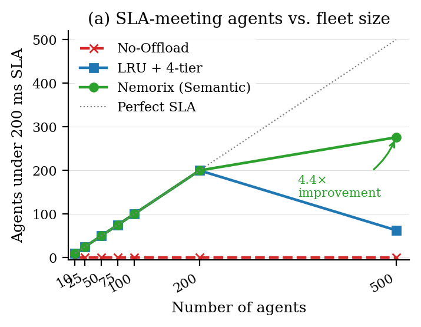

# Nemorix

> **Virtual Memory for LLM Agent State** — CXL-aware KV-cache tiering.  
> Model CXL-aware storage for hundreds of persistent agents: **74× lower modeled resume latency, 85% lower modeled cost.**

[](https://opensource.org/licenses/MIT)
[](https://www.python.org/downloads/)
[](tests/)

---

## What It Is

A 64K Llama-3-70B KV-cache is ~21.5 GiB, so an idealized 80 GiB cache-only budget
fits about 3.7 complete caches. The simulator does not subtract model weights or runtime
workspace; deployment requires a smaller KV budget, quantized weights, or tensor parallelism.
The supplied synthetic workload models agents as inactive in 75–98% of one-minute
intervals. Nemorix treats agent KV-cache like OS
virtual memory, paging idle agents across a four-tier hierarchy:

| Tier | Capacity | Bandwidth | Recall latency | Cost/GB/mo |
|------|----------|-----------|----------------|------------|
| GPU VRAM | 80 GB | 3,000 GB/s | — (active) | $40 |
| CXL Memory | 512 GB | 36 GB/s | ~16 ms | ~$4 |
| CPU RAM | 256 GB | 50 GB/s | ~20 ms | ~$2 |
| NVMe SSD | 4 TB | 7 GB/s | ~230 ms | ~$0.10 |

When an idle agent wakes, the simulator charges the first 10% of layers to the
critical path and assumes the remainder overlaps with compute: **~16 ms** modeled
page-in instead of **~1,200 ms** modeled full recomputation.

This repository is a **specification-calibrated analytical simulator** covered by 74 tests,
plus a reference API. It is the research artifact behind the paper
([PAPER_SUBMISSION.tex](PAPER_SUBMISSION.tex)).

---

## Setup

```bash
# Clone and enter
git clone https://github.com/bahaouni/nemorix.git
cd nemorix

# Create a virtual environment
python -m venv .venv
source .venv/bin/activate          # Windows: .\.venv\Scripts\Activate.ps1

# Install (pure standard library — no runtime dependencies)
pip install -e ".[dev]"
```

Requires **Python 3.10+**.

---

## Use

```bash
# 1. Run the tests (74 pass in ~3 min)
python -m pytest tests/ -q

# 2. Run the main benchmark (50 agents, 24 h)
python benchmarks/run_simulation.py

# 3. Reproduce the multi-seed robustness numbers
python benchmarks/run_robustness.py --seeds 8

# 4. See where semantic eviction wins (10 → 500 agents)
python benchmarks/compare_policies.py
```

From Python:

```python
from nemorix.simulation.runner import SimulationRunner, SimulationConfig

runner = SimulationRunner(SimulationConfig(num_agents=100))
metrics = runner.run("semantic")
print(metrics.sla_agents, metrics.avg_resume_latency_ms)
```

**Full simulator guide:** [benchmarks/README.md](benchmarks/README.md)

---

## Results (reproducible, seed 42)

| Metric | No Offload | LRU | **Nemorix** |
|--------|-----------|-----|-------------|
| Agents under 200 ms SLA | 0 / 50 | 50 / 50 | **50 / 50** |
| Avg resume latency | 1,205 ms | 16.8 ms | **16.2 ms** |
| P99 resume latency | 1,638 ms | 27.8 ms | **27.8 ms** |
| Cost per agent-hour | $7.01 | $0.17 | **$0.17** |

Mean over 8 seeds: No-Offload 1,151 ± 42 ms → Nemorix **15.6 ± 0.5 ms** (**74× reduction**,
85% cost reduction). At **500 agents**, semantic eviction keeps **4.4× more agents under
SLA** than LRU (276 vs 63) once the modeled CXL pool saturates. This saturated scaling point
uses one seed; it is not a hardware measurement or a production capacity guarantee.



---

## Project Layout

```
src/nemorix/            Core library (tiers, agents, scheduler, policies, API)
  core/                 KVBlock, TierManager, AgentMemoryObject, Scheduler
  policies/             LRU baseline + Semantic Retention Law (README inside)
  runtime/              Optional FP8 GPU↔RAM/NVMe prototype + vLLM adapter
  simulation/           Discrete-event SimulationRunner + WorkloadGenerator
  api/                  FastAPI control-plane server (optional)
benchmarks/             Simulator entry points + reproducible JSON results
assets/                 Paper figures (generated by benchmarks/make_paper_figures.py)
tests/                  80 tests: physics, policies, invariants, runtime orchestration
docs/                   Full documentation site (docsify)
PAPER_SUBMISSION.tex    Research manuscript (LaTeX)
```

---

## What Is Implemented vs Modeled

| Capability | Current status |
|---|---|
| KV sizing, tier capacities, compression ratios, transfer arithmetic | Implemented analytically and tested |
| LRU, semantic value-density policy, and Belady comparison baseline | Implemented in the simulator |
| Per-agent activation timescale learned with EWMA | Implemented |
| Importance/attention signal | **Synthetic proxy**; no transformer attention is collected |
| GPU → CXL → RAM → SSD migration primitives | Implemented analytically in the reference core/API |
| Timed 1τ/2τ/3τ lifecycle in reported benchmarks | **Not exercised**; runner uses simplified direct placement |
| Real CUDA → pinned RAM FP8 transfer | Implemented with optional PyTorch; CUDA hardware results pending |
| RAM → local NVMe spill | Implemented with buffered file I/O; not GPUDirect Storage |
| Critical-layer partial page-in | Implemented in the runtime prototype and modeled in simulation |
| Remaining-layer background transfer | Implemented; overlap with actual model compute is not yet validated |
| vLLM paged-cache integration | Tensor/block adapter implemented; version-pinned scheduler connector pending |
| Model weights and runtime workspace in the 80 GB GPU budget | Not modeled; capacity is dedicated to KV state |
| CXL contention, DMA queues, NUMA effects, concurrent wake bursts | Not modeled |
| Quantized KV task quality | Not measured |
| H100 + physical CXL end-to-end system | Not yet validated |

The Retention Law is a heuristic, not a proof of optimality. Density ordering is optimal for
fractional knapsack, but KV blocks are indivisible. A sensitivity/term-ablation harness exists,
but its full post-calibration run and real-trace validation remain required.


## License

MIT — see [LICENSE](LICENSE). Contributions welcome; see [CONTRIBUTING.md](CONTRIBUTING.md).
